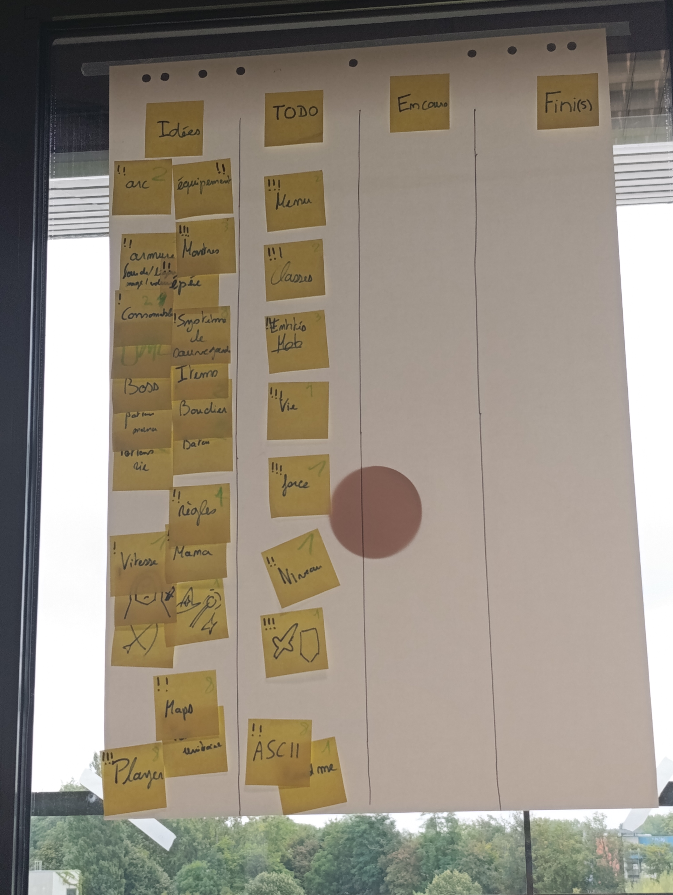
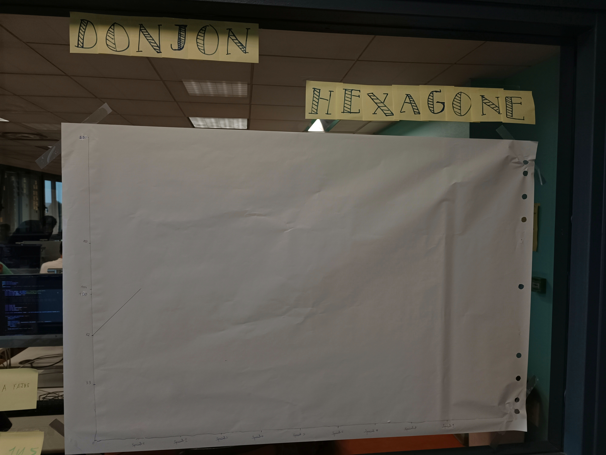

# Sprint 0

## Démo + Planification du sprint suivant

### Ce que nous avons fait durant ce sprint
nous avons
* proposer des idées 
* organiser les idées par priorité et difficultés
* fait le burn-up 

Donnez ici la liste des histoires utilisateurs que vous avez livrées durant ce sprint.
Vous pouvez utiliser cette liste pour préparer votre démo.

### Ce que nous allons faire durant le prochain sprint

* Nous allons préparer la classe d'Item
* Les premières classes entités et monstres
* Le fait d'avoir des points de vie, des points de force 
* Le menu de base 
* Le système de classe et la première classe qui ets la classe guerrier
* Les différents effets de potions
* Les types de raretés
* La classe de base d'équipement, aussi pour l'épée et les consommables.

## Rétrospective

### Sur quoi avons nous butté ?
Lister ici tout ce qui était un peut moins bien que parfait.
* pas vraiment on a pas lu attentivement les slides donc il nous manquait des informations dans le radiateur d'inforamtions.
* oui, nous étions prêt.

### PDCA
* L'oragnisation et la répartition des tâches peuvent être améliorées.
* A l'aide de la burn-up chart nous pouvons voir notre avancé et notre amélioration pour le moment on l'a juste mis en place mais il nous sera utile pour les prochains sprints.

# Mémo

