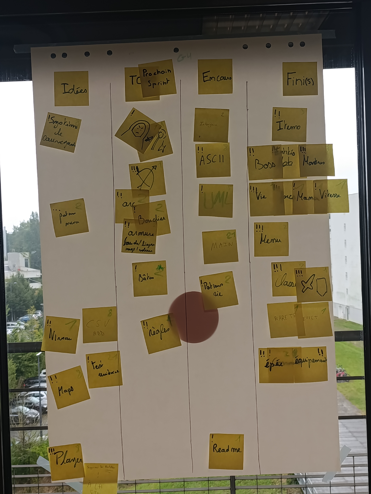
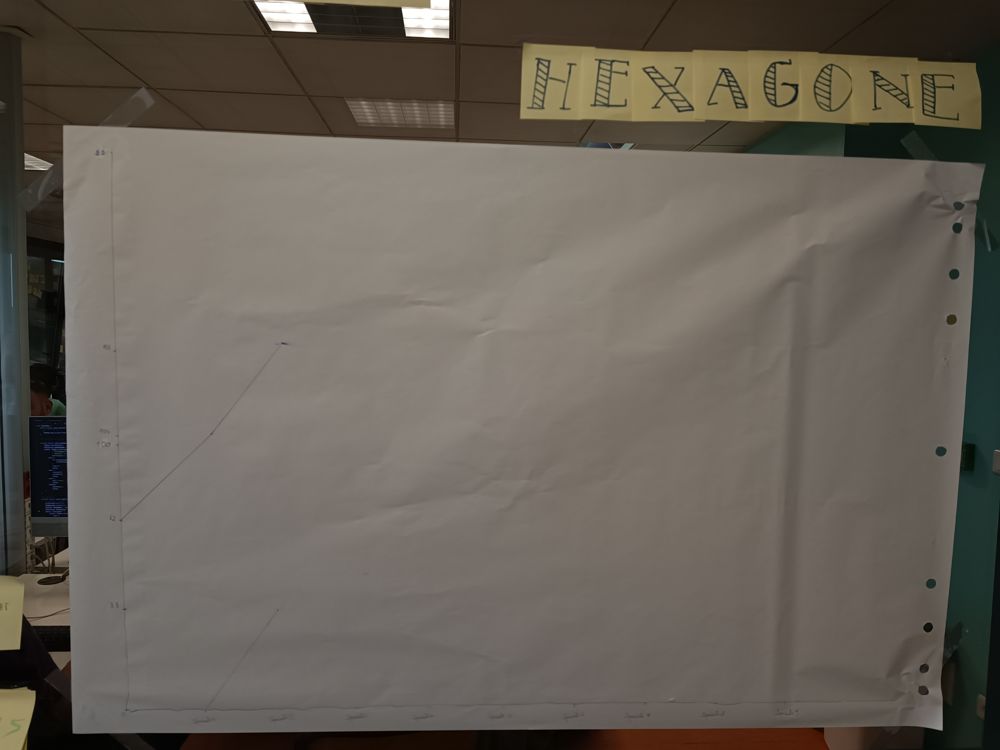

# Sprint 1

### Ce que nous avons fait durant ce sprint

* Nous avons préparer la classe d'Item
* Les premières classes entités et monstres
* Le fait d'avoir des points de vie, des points de force 
* Le menu de base 
* Le système de classe et la première classe qui ets la classe guerrier
* Les différents effets de potions
* Les types de raretés
* La classe de base d'équipement, aussi pour l'épée et les consommables.

### Ce que nous allons faire durant le prochain sprint
* L'interface
* Trouver de nouveaux ASCII
* Avancer le diagramme UML
* Commencer le fichier Main pour avoir le fonctionnement du jeu
* Les potions de vie
* Compléter le readme pour le prochain sprint.

### Sur quoi avons nous butté ?
* Problèmes avec git lors de push en même temps.

### PDCA
* De tous ces éléments quel est celui que vous voulez améliorer ? Nous voulons s'organiser à faire des choses plus difficiles, mieux organiser les classes pour qu'elles aient des cohérences entre elles.
* Comment pouvez-vous mesurer qu'il s'améliore ? PLus parler entre nous pendant qu'on code.
* Quelles sont toutes les options possible pour l'améliorer ? PAs énormément d'améliorations sont possibles, on est assez organisé.
* Qu'allez-vous tester pour l'améliorer ? D'améliorer la communication entre chacun.

