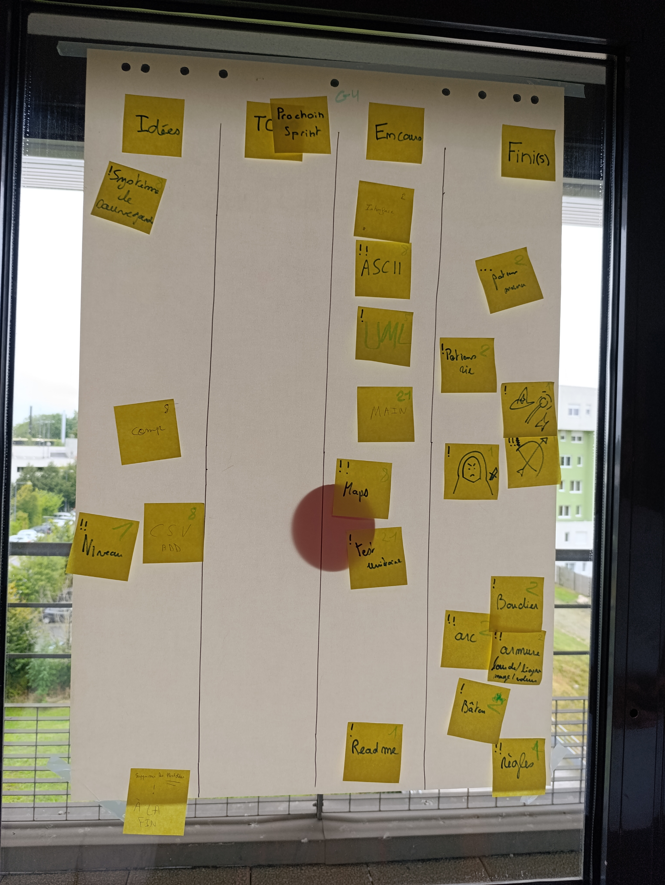
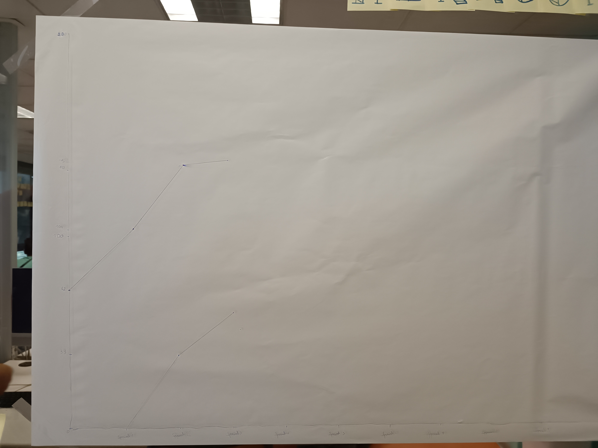

# Sprint 2

### Ce que nous avons fait durant ce sprint

* Les classes pour les équipements
* La mise en place des consommables
* La constructon du Main
* La création de lien divers entre les classes
* L'enum pour les equipements
* La classe Joueur

### Ce que nous allons faire durant le prochain sprint
* L'interface
* Trouver de nouveaux ASCII
* Finalisation des classes pour le joueur
* Bien avancer la fonction Main
* Corriger quelques fonctions
* Compléter le readme pour le prochain sprint.

### Sur quoi avons nous butté ?
* Faire le liens entre les autres fichier class et le Main.

### PDCA
* De tous ces éléments quel est celui que vous voulez améliorer ? Toujours continuer dans le même sens, améliorer notre code et faire en sorte que le Main puisse fonctionner.
* Comment pouvez-vous mesurer qu'il s'améliore ? PLus parler entre nous pendant qu'on code.
* Quelles sont toutes les options possible pour l'améliorer ? Pas énormément d'améliorations sont possibles, on est assez organisé.
* Qu'allez-vous tester pour l'améliorer ? D'améliorer la communication entre chacun.

