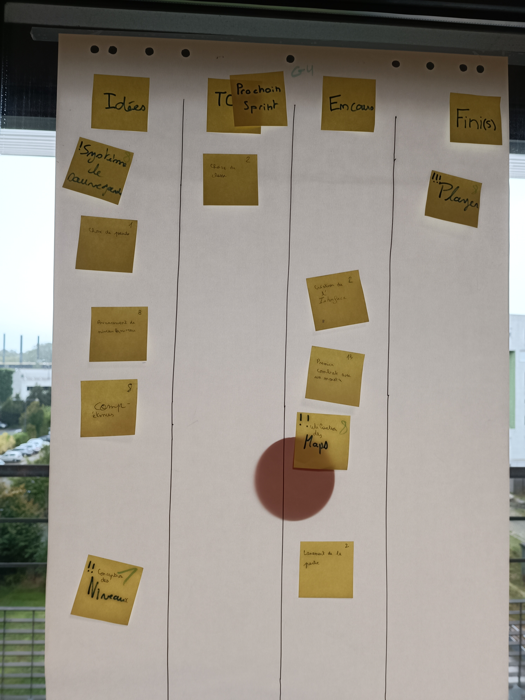
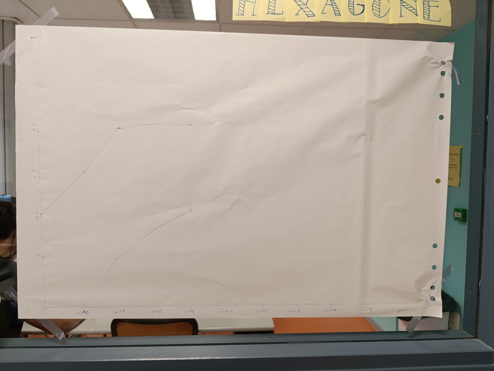

# Sprint 3

### Ce que nous avons fait durant ce sprint

* La création de la carte du jeu
* La correction de certain problème dans des classes
* L'avancé du fichier Main pour qu'il devienne un minimum utilisable
* La mise en place de l'interface.

### Ce que nous allons faire durant le prochain sprint
* Terminer l'interface
* Trouver de nouveaux ASCII
* Le design des monstres
* Toujours bien avancer la fonction Main
* Corriger quelques fonctions
* Compléter le readme pour le prochain sprint.

### Sur quoi avons nous butté ?
* Faire le liens entre les autres fichier class et le Main.

### PDCA
* De tous ces éléments quel est celui que vous voulez améliorer ? Toujours continuer dans le même sens, améliorer notre code et faire en sorte que le Main puisse fonctionner de plus de devoir corriger sur le tas quelques classes.
* Comment pouvez-vous mesurer qu'il s'améliore ? PLus parler entre nous pendant qu'on code.
* Quelles sont toutes les options possible pour l'améliorer ? Pas énormément d'améliorations sont possibles, on est assez organisé.
* Qu'allez-vous tester pour l'améliorer ? D'améliorer la communication entre nous pour toujours être plus efficace.

