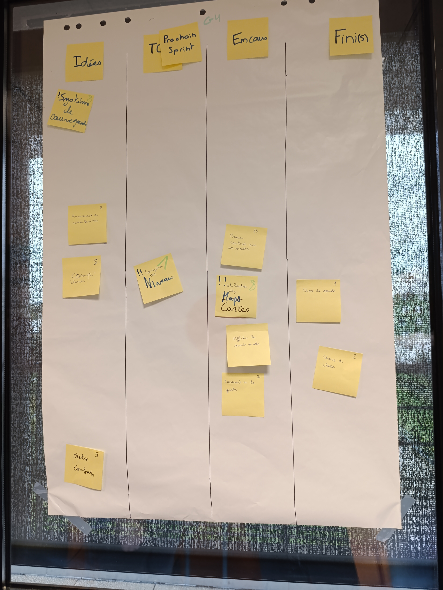
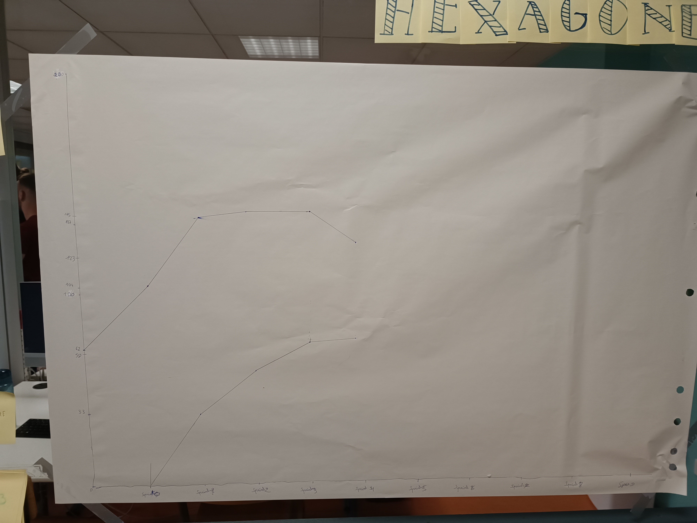

# Sprint 4

### Ce que nous avons fait durant ce sprint

* Avancer sur la conception de la carte du jeu
* Premier combat avec un monstre dans le fichier Main
* Capacité à lancer la partie
* Correction de certaines classes

### Ce que nous allons faire durant le prochain sprint
* Choix de classe pour le joueur
* Choix de pseudo pour le joueur
* Correction de certain problème avec une ou des classes pou le bon foctionnement du fichier Main.

### Sur quoi avons nous butté ?
* La quantité de travail un peu trop élévé pour les tâches qu'il nous restais à faire

### PDCA
* De tous ces éléments quel est celui que vous voulez améliorer ? Toujours améliorer notre code et compléter le fichier Main petit à petit.
* Comment pouvez-vous mesurer qu'il s'améliore ? Travailler un peu plus en groupe pour les tâches plus complexe en plus de calculer la vélocité de nos sprints.
* Quelles sont toutes les options possible pour l'améliorer ? La communication qui doit être plus importante.
* Qu'allez-vous tester pour l'améliorer ? D'améliorer la communication et l'écoute entre nous.

