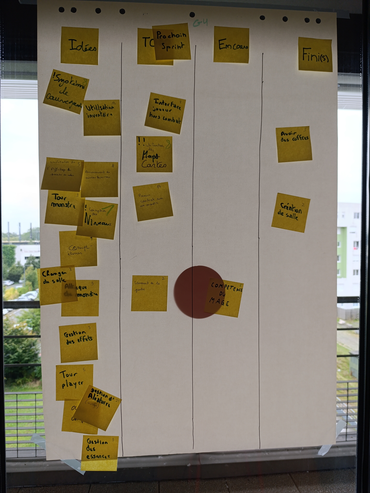
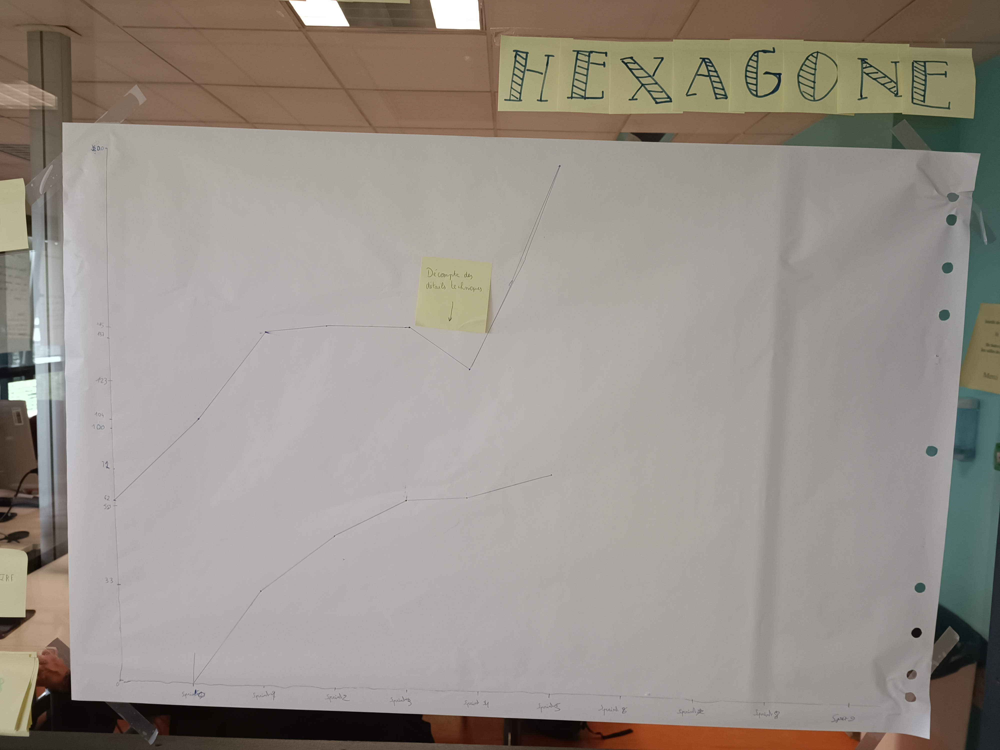

# Sprint 5

### Ce que nous avons fait durant ce sprint

* Le mage possède des capacité encore inutilisable
* Création des salles du donjon
* Avoir des coffres
* Correction de certaines classes.

### Ce que nous allons faire durant le prochain sprint

* Premier combat avec un monstre
* L'interface joueur hors combat
* La carte du jeu
* Lancement de la partie.

### Sur quoi avons nous butté ?
* La mise en lien de toute les classes que nous avons créé

### PDCA
* De tous ces éléments quel est celui que vous voulez améliorer ? Essayer de mieux gérer le fait de mettre en liens tout les programmes afin de créer quelques chose d'utilisable
* Comment pouvez-vous mesurer qu'il s'améliore ? Faire en sorte que le fichier Main puisse afficher notre jeu
* Quelles sont toutes les options possible pour l'améliorer ? Encore un léger manque de communication, qui s'est amélioré comparé au dernier sprint
* Qu'allez-vous tester pour l'améliorer ? Toujours essayer d'améliorer la cohésion entre notre groupe

