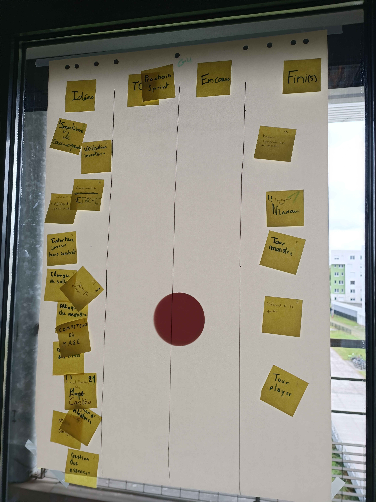
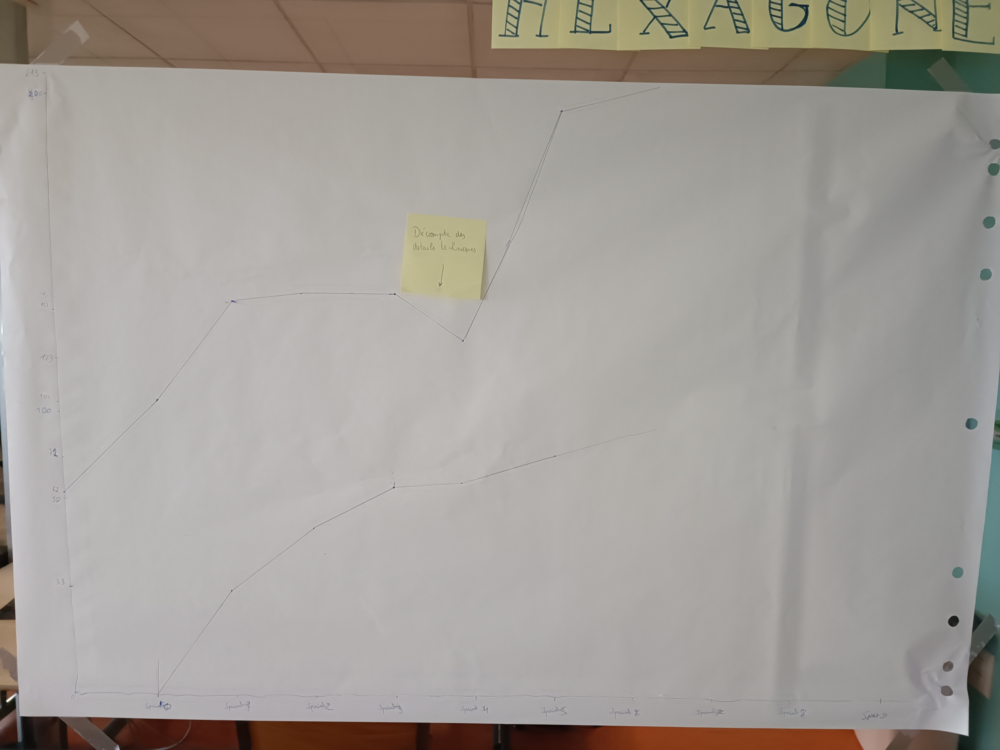

# Sprint 6

### Ce que nous avons fait durant ce sprint

* Le tour du monstre
* Le tour du joueur
* La conception des niveaux
* Le lancement de la partie
* Le premier combat avec un monstre

### Ce que nous allons faire durant le prochain sprint

* Les attaques du monstres
* La gestions des cartes
* Les compétences en général

### Sur quoi avons nous butté ?
* La mise en lien de toute les classes que nous avons créer + correction de certains bug

### PDCA
* De tous ces éléments quel est celui que vous voulez améliorer ? Essayer de mieux gérer le fait de mettre en liens tout les programmes afin de créer quelques chose d'utilisable
* Comment pouvez-vous mesurer qu'il s'améliore ? Faire en sorte que le fichier Main puisse être utilisé pour naviguer entre les salles
* Quelles sont toutes les options possible pour l'améliorer ? Encore un léger manque de communication, qui s'est amélioré comparé au dernier sprint
* Qu'allez-vous tester pour l'améliorer ? Toujours essayer d'améliorer la cohésion entre notre groupe

