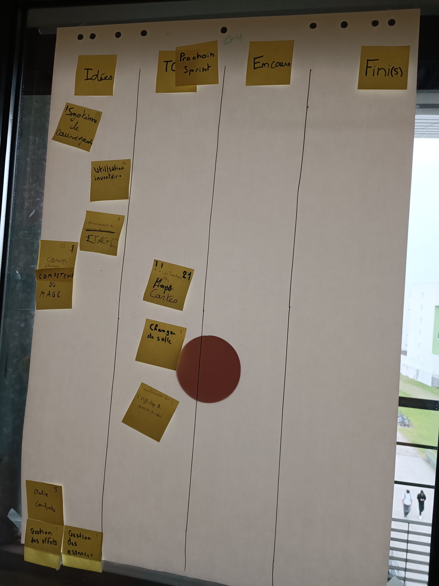
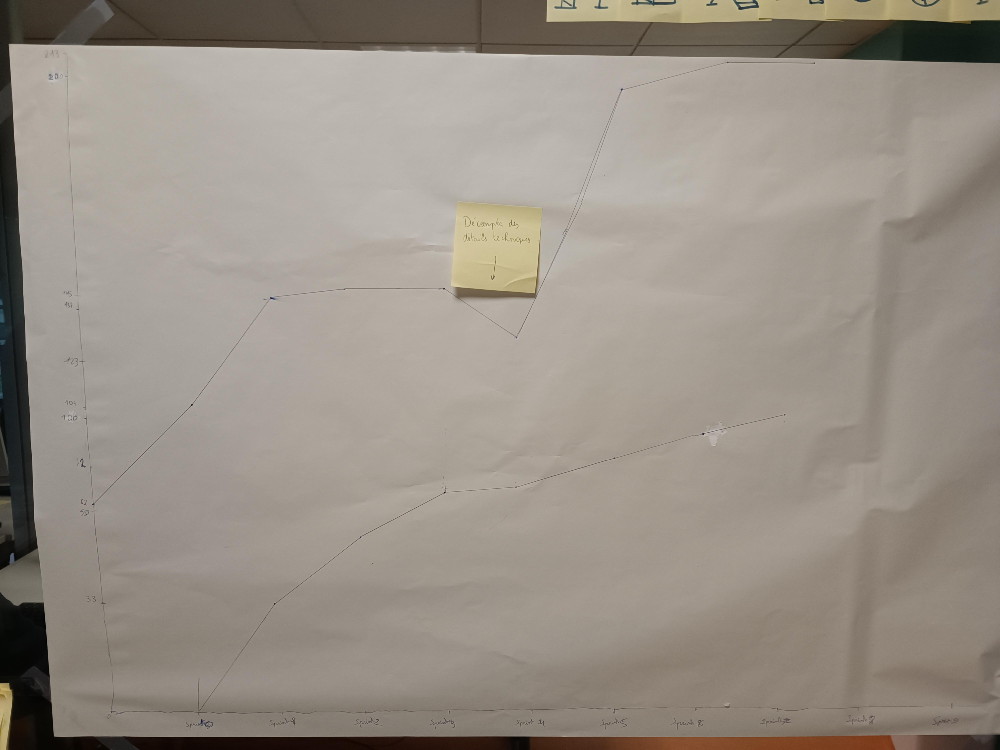

# Sprint 7

### Ce que nous avons fait durant ce sprint

* Les attaques du monstres
* La gestions des cartes
* Les compétences en général

### Ce que nous allons faire durant le prochain sprint

* Utilisation des cartes
* Changer de salles
* Amélioration de l'affichage des points de vies
* Gestion de l'aléatoire

### Sur quoi avons nous butté ?
* Réussir à parcourir les ficher texte en ASCII pour l'affichage des monstres + affichage de la salle + correction de certain bug

### PDCA
* De tous ces éléments quel est celui que vous voulez améliorer ? La mise en foction du Main qui manque encore d'implémentation dans le but de finaliser notre jeu
* Comment pouvez-vous mesurer qu'il s'améliore ? Faire en sorte de naviguer entre les salles afin de povoir terminer un étage pour l'avancé du jeu
* Quelles sont toutes les options possible pour l'améliorer ? Se concentrer sur des tâches plus complexe en petit groupe afin d'être possiblement plus efficace
* Qu'allez-vous tester pour l'améliorer ? Travailler en groupe sur le Main dans le but de permettre une grande avancé pour notre jeu

