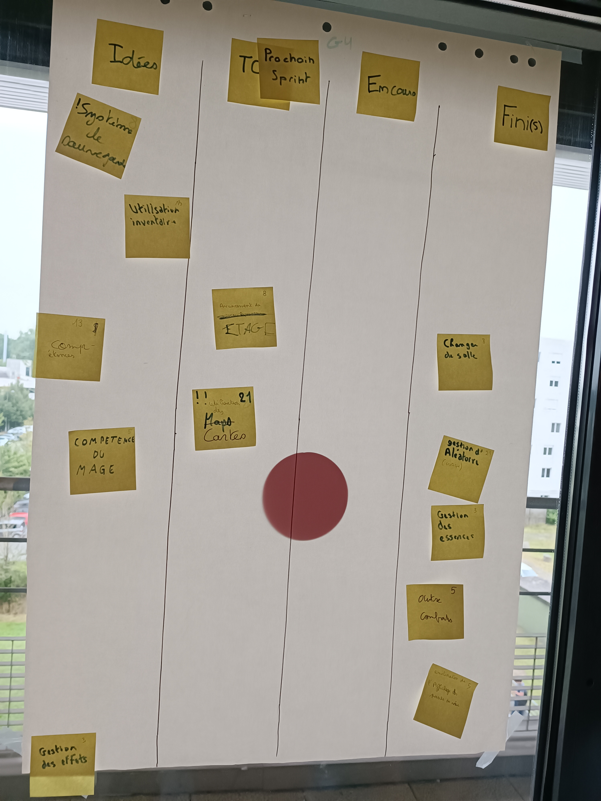
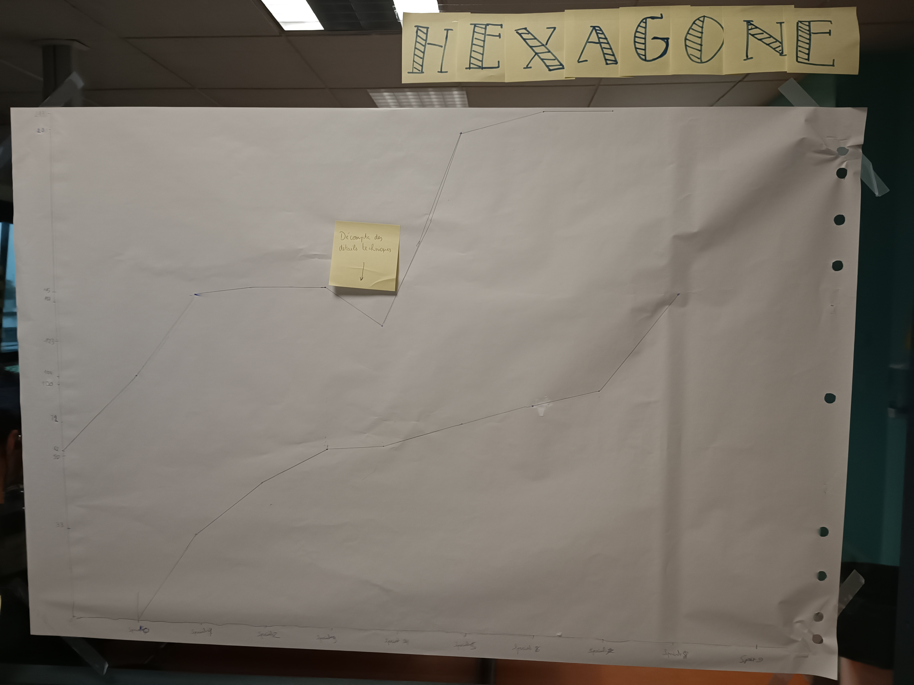

# Sprint 8

### Ce que nous avons fait durant ce sprint

* Utilisation des cartes
* Changer de salles
* Amélioration de l'affichage des points de vies
* Gestion de l'aléatoire

### Ce que nous allons faire durant le prochain sprint

* Faire la carte du jeu
* Possibilité d'avancer dans les étages

### Sur quoi avons nous butté ?
* Le Main dont la bonne fonctionnalité du jeu

### PDCA
* De tous ces éléments quel est celui que vous voulez améliorer ? Aller encore plus vite
* Comment pouvez-vous mesurer qu'il s'améliore ? En se concentrant sur l'essentiel et choisir nos priorités
* Quelles sont toutes les options possible pour l'améliorer ? Se focaliser en particulier sur le fait que le jeu ne bug pas et soit présentable
* Qu'allez-vous tester pour l'améliorer ? Aller encore plus vite pour la finalisation du jeu

