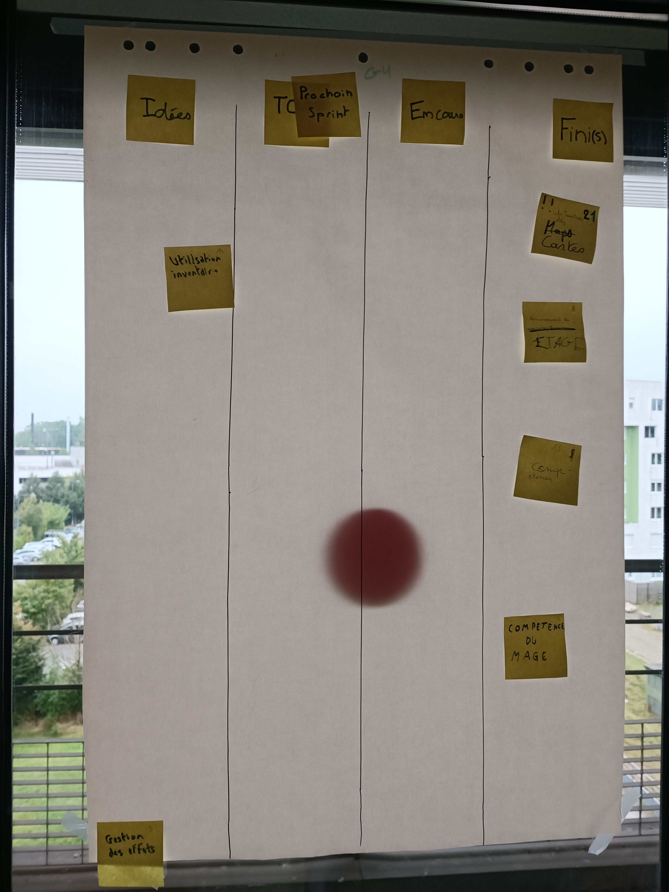
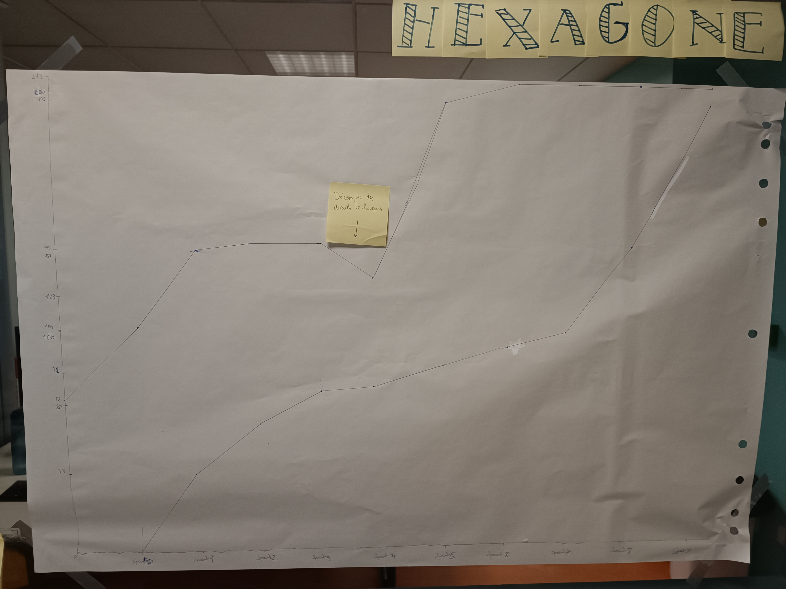

# Sprint 9

### Ce que nous avons fait durant ce sprint

* Faire la carte du jeu
* Possibilité d'avancer dans les étages
* Système de critique
* Capacité du mage

### Ce que nous allons faire durant le prochain sprint

### Sur quoi avons nous butté ?
* Le Main dont la bonne fonctionnalité du jeu

### PDCA
* De tous ces éléments quel est celui que vous voulez améliorer ? Le Main
* Comment pouvez-vous mesurer qu'il s'améliore ? Avec le visuel qui est formé
* Quelles sont toutes les options possible pour l'améliorer ? Finir le jeu à 100%
* Qu'allez-vous tester pour l'améliorer ? Le visuel et tout le reste des fonctionnalité

